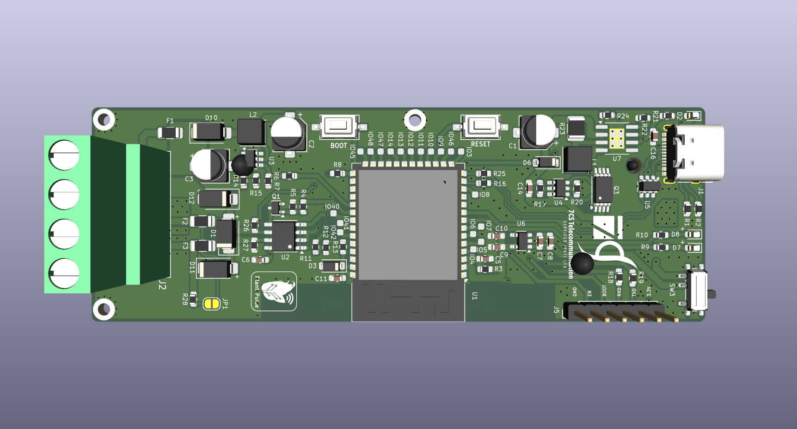
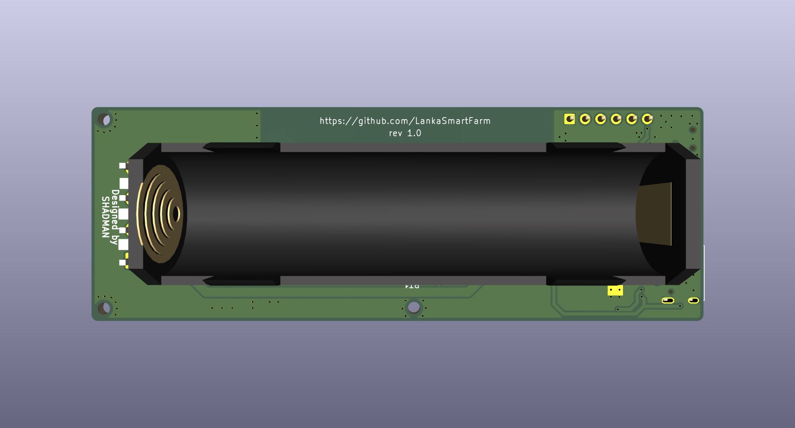
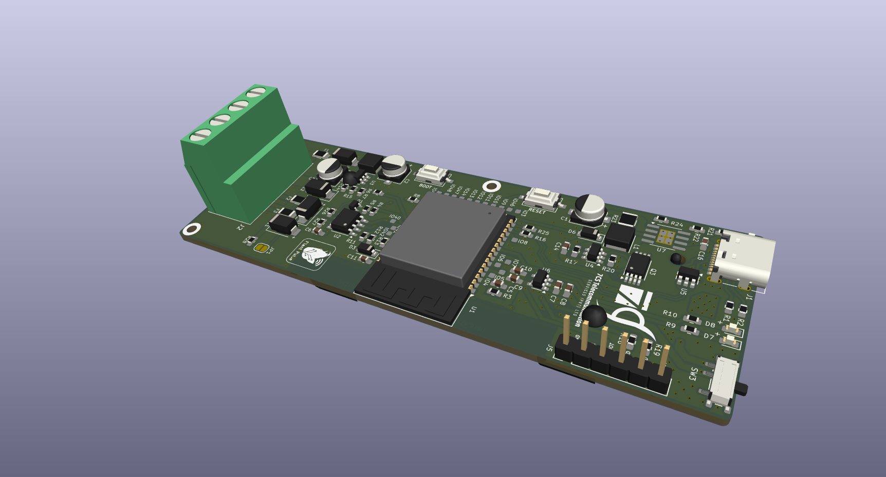
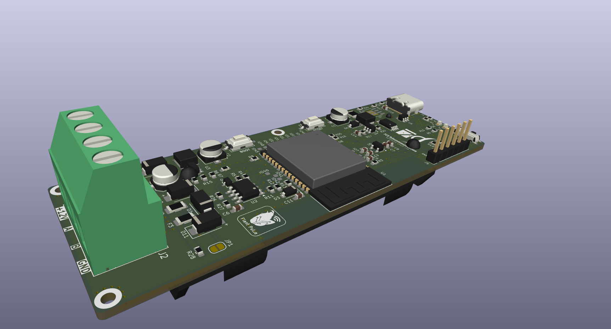

# 🌿 Plant Pulse Hardware V1.0 (PCB)

### Featuring **ESP32-S3**

---

## 🧩 Overview
**Plant Pulse Hardware V1.0** is a custom-designed PCB built around the powerful **ESP32-S3** microcontroller.  
It is designed to monitor and analyze plant health and environmental conditions using advanced sensors and smart communication protocols.

---

## ⚙️ Key Features
- 🌱 **ESP32-S3** for Wi-Fi and Bluetooth connectivity  
- 🌾 **7-in-1 Soil Sensor Interface** for measuring multiple soil parameters  
- 🔄 **RS485 Modbus Communication** support for reliable industrial sensor interfacing  
- 🔋 **3.7V Li-ion Battery** operation for portable applications  
- 🔌 **USB Type-C Charging** for easy power management  

---

## 🔧 Hardware Highlights
| Component | Description |
|------------|-------------|
| **MCU** | ESP32-S3 |
| **Sensor Interface** | 7-in-1 Soil Sensor via UART/RS485 |
| **Communication Protocol** | Modbus RTU |
| **Power Source** | 3.7V Li-ion Battery |
| **Charging Port** | USB Type-C |
| **Regulators & Protection** | Integrated battery protection and voltage regulation |

---

## 🪛 Applications
- Smart Agriculture 🌾  
- IoT-Based Plant Monitoring 🌿  
- Greenhouse Automation 🌼  
- Environmental Data Logging ☀️  

---

## 📘 Version Information
- **Version:** 1.0  
- **Type:** PCB Hardware Design  
- **Status:** Prototype/Testing Phase  

---

## 🧠 Future Improvements
- Onboard display (OLED/TFT) for real-time readings  
- Power optimization for long-term field deployment  

---

## 🖼️ Preview






```bash
📁 /PlantPulse_Hardware_V1.0
 ├── Gerber_Files/
 ├── Schematic PDF/
 ├── Board_3D_Render
 ├── BOM_POS/
 └── README.md
